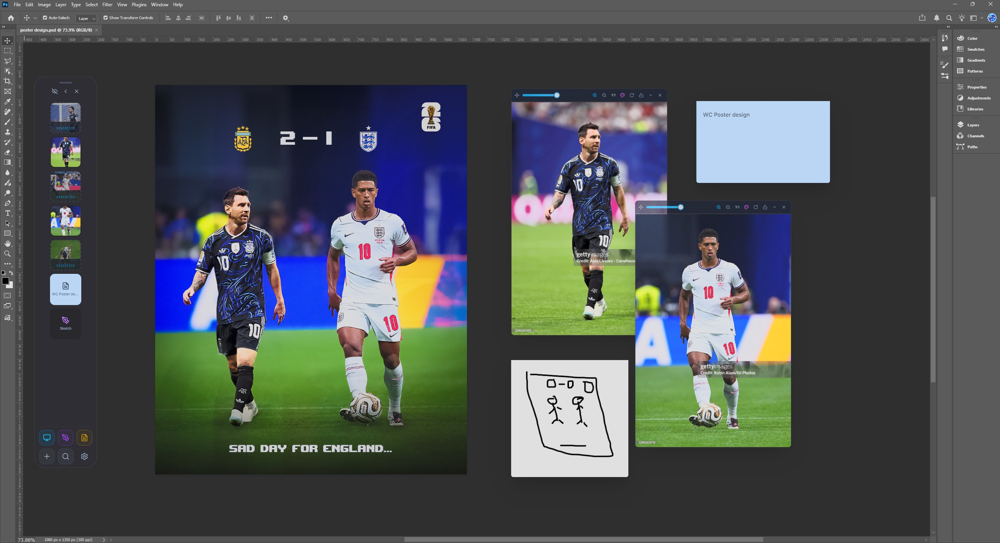
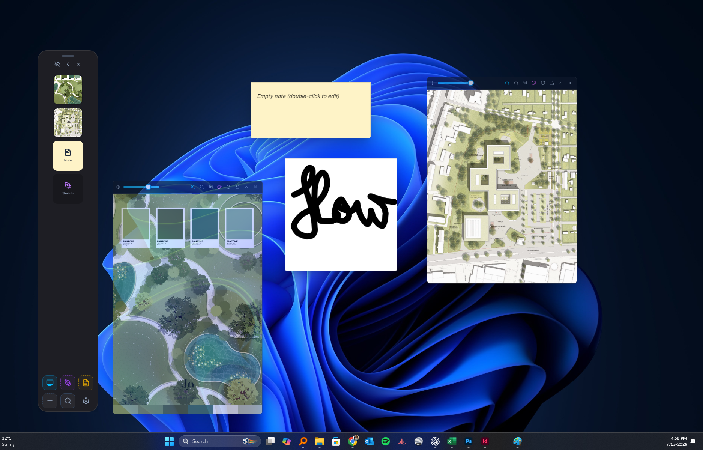
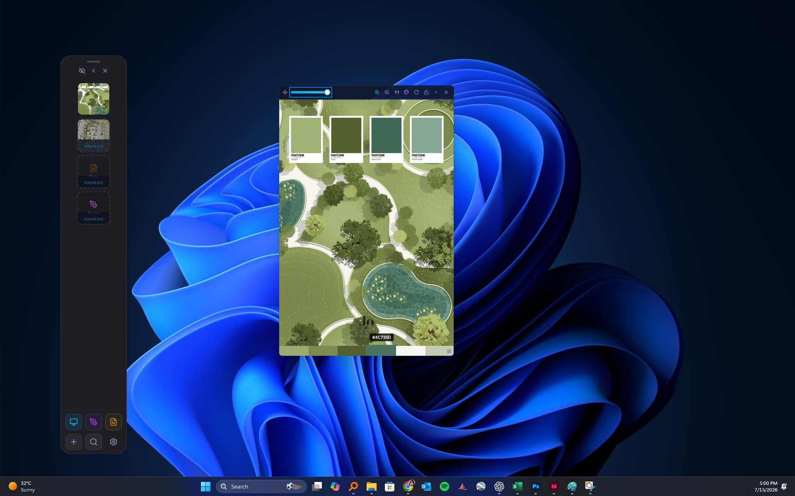

# RefFlow Studio

RefFlow Studio is a Windows desktop asset workspace and reference-board app for artists, designers, and developers. It keeps images, documents, Adobe source files, notes, sketches, Brand Kits, and visual search close to the creative apps where you work.

## Video Demo


[Watch the full-resolution showcase with sound](https://github.com/amine1859/Referenceflow-Studio/releases/download/v1.0.2/refflow.showcase.mp4).

## Screenshots

### Work directly over Photoshop



### Build a flexible floating reference board



### Inspect references and extract color palettes



## Features

- Floating pill control panel for quick actions.
- Draggable image and PDF reference windows.
- Native drag-out of image references into Photoshop and other Windows apps.
- Monitor-aware placement across mixed multi-display desktop layouts.
- Native click-through for transparent desktop areas and locked references.
- Notes and sketch pads for board annotations.
- Brand Kits with Moodboard, Guidelines, Logos, Primary and Secondary Colors, Typography, Icons, Imagery, Textures, and Templates.
- One-click logo palette extraction plus copyable HEX, RGB, HSL, and CMYK color values.
- Brand Typography can use fonts already installed in Windows, while imported font files stay visible in the pill and Brand Kit.
- Smart board folders for images, documents, PDFs, Illustrator/EPS, InDesign, Photoshop, notes, and sketches.
- Local PSD/PSB, AI/AIT, EPS, INDD/INDT/IDML, OTF, TTF, WOFF, and WOFF2 assets with native-app opening, Explorer reveal, and drag-out.
- Universal board and asset search with a customizable shortcut (Ctrl+Alt+F by default).
- Portable `.refflow` packages for sharing and importing complete boards or Brand Kits.
- Project manager for multiple local boards, with local autosave folders whose names match the boards.
- Native Windows installer built with Electron Builder.

## Requirements

- Windows 10 or later for the packaged app.
- Node.js 20 or later for development.

## Support RefFlow Studio

RefFlow Studio is free for everyone. If you would like to support ongoing bug fixes, improvements, and new features, you can become a supporter on [Patreon](https://www.patreon.com/RefFlowStudio).

## Development

Install dependencies:

```bash
npm install
```

Run the Vite development server:

```bash
npm run dev
```

Run the Electron app in development mode:

```bash
npm run electron:dev
```

Type-check the project:

```bash
npm run lint
```

Build the frontend:

```bash
npm run build
```

Build the Windows installer:

```bash
npm run electron:dist
```

The installer is written to `dist_desktop/`.

## Release Notes

- Build artifacts such as `dist/`, `dist_desktop/`, `.exe`, and `.blockmap` files are ignored by Git.
- The installer uses `assets/referenceflow.ico` for installer, uninstaller, and app executable branding.
- The app executable runs as the current user so normal desktop interactions are not blocked by Windows elevation rules.
- v2.0.0 is the unsigned asset-handling release: Brand Kits, Windows font selection, smart folders, Adobe/font source-file handling, universal asset search, and portable board packages. The signed build will replace it when the certificate is ready.

## Security and privacy

- [Code signing policy](CODE_SIGNING.md) — free code signing provided by SignPath.io, certificate by SignPath Foundation.
- [Privacy policy](PRIVACY.md) — explains local storage and the user-initiated connections made by search and support features.

## Updates

- Starting with v1.0.3, installed builds check GitHub Releases after startup and periodically while running. Updates download in the background, and RefFlow Studio asks before restarting to install them.
- If you have v1.0.2 or older, download the current installer from [GitHub Releases](https://github.com/amine1859/Referenceflow-Studio/releases) and run it once over the existing installation. The stable app ID and Windows data directory preserve local boards and preferences. Later releases can then update in-app.
- Release automation must publish the signed installer together with the matching `latest.yml` generated after signing.

## License

MIT
